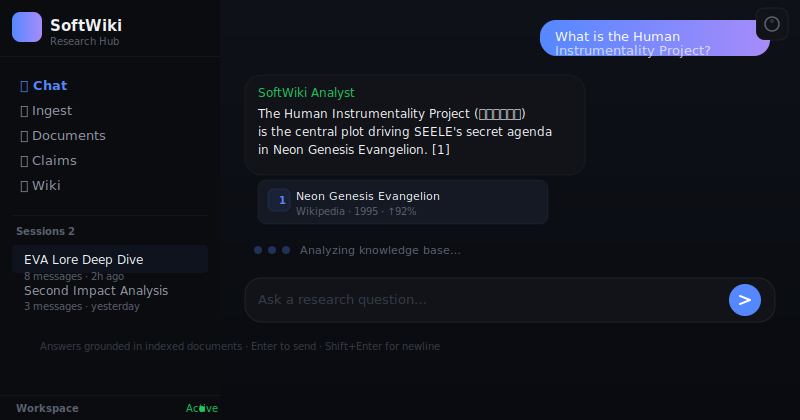

# SoftWiki

**Multi-Strategy Research Intelligence Engine.** Unifies RAG, GraphRAG, and LLM-Wiki (Karpathy architecture) into a single MCP-powered knowledge platform. Designed for deep research workflows across isolated knowledge bases.



## Why SoftWiki?

> **Not another RAG tool.** SoftWiki is a knowledge operating system — orchestrating heterogeneous retrieval strategies, autonomous extraction pipelines, and agentic collaboration through the Model Context Protocol.

### Hybrid Cognitive Architecture

| Strategy | Method | Use Case |
|----------|--------|----------|
| **RAG** | Dense + BM25 hybrid, RRF fusion | Factual retrieval, citation-backed answers |
| **GraphRAG** | LightRAG — BFS subgraph traversal, 6 query modes | Multi-hop reasoning, relational deep-dives |
| **LLM-Wiki** | Karpathy-style compounding markdown | Persistent knowledge synthesis, human-readable reports |

### Intelligence Spectrum

- **Per-Scope Intelligence** — Each knowledge base operates within a defined scope (scope.md), auto-rejecting out-of-domain queries
- **Multi-Layer Extraction** — Claims (actor/stance), entities/relations, timeline events — extracted asynchronously per document
- **Confidence Calibration** — Every answer carries a confidence assessment grounded in source provenance

### Elastic Architecture

```
Laptop                        → Cluster
─────────────────────────────────────────
SQLite + JSON files           → PostgreSQL + Qdrant + Neo4J
Single-user Shell             → Multi-tenant MCP Gateway
One workspace                 → N isolated knowledge bases
```

One env var changes the storage backend. Zero code changes.

### MCP-Native Agent Ecosystem

17 tools exposed through the Model Context Protocol — any MCP-compatible agent (Claude, opencode, Cursor) becomes a native knowledge worker:

| Domain | Tools |
|--------|-------|
| **Retrieval** | `ask`, `search`, `retrieve` |
| **Graph** | `lightrag_query`, `lightrag_explore`, `graph_query` |
| **Ingestion** | `ingest`, `index` |
| **Synthesis** | `wiki_build`, `wiki_read` |
| **Temporal** | `timeline_query`, `claim_query` |
| **Discovery** | `source_list`, `source_preview`, `web_search`, `status` |

### Multi-Surface Experience

- **Shell TUI** — opencode-powered research shell, zero core dependency
- **WebUI** — Next.js 16 dashboard, dark theme, session management, Wikipedia-style reader
- **Headless** — MCP stdio server for any MCP-compatible host

## Quick Start

```bash
pip install softwiki[graph]
softwiki init
softwiki ingest --url "https://example.com/article"
softwiki ask "Synthesize the key arguments"
softwiki shell
```

## Documentation

[Architecture, Design Whitepaper, Operations & Guides →](docs/README.md)

## Requirements

- Python 3.10+
- opencode (optional, for Shell TUI)

## License

MIT
