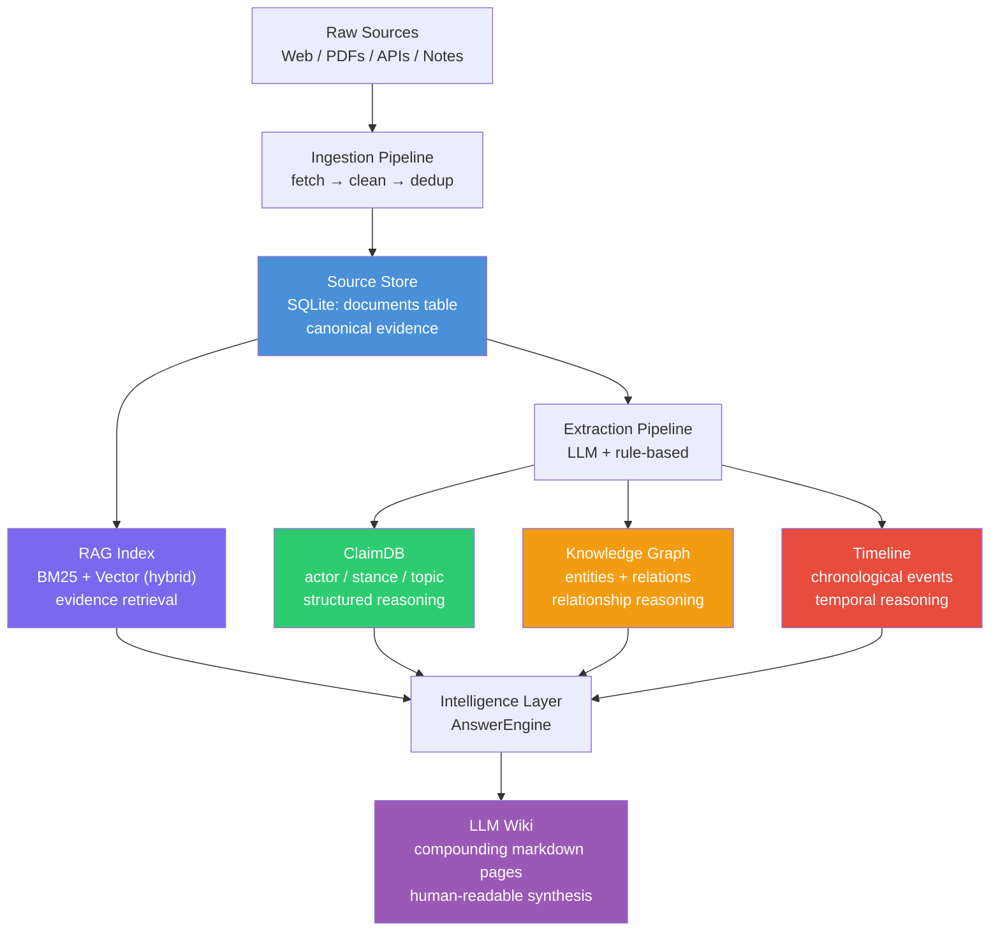

# Data Flow Architecture

## 五层知识模型

SoftWiki derives **six complementary views** from the same canonical source store. Each view is purpose-built for a different kind of query — evidence retrieval, structured reasoning, relationship analysis, temporal reasoning, and human-readable synthesis. They are not independent databases; they are projections of the same underlying evidence.



Each layer derives from the layer directly below it. The direction of arrows is the direction of derivation — every downstream artifact can be traced back to one or more rows in the Source Store.

---

## 各层职责

### Source Store — canonical evidence

- **What it is**: A SQLite database (`processed.db`) where every ingested document lives as a single row in the `documents` table, alongside its `raw_text` (original) and `cleaned_text` (normalized) representations.
- **What it holds**: Original HTML/PDF text, normalized markdown, document metadata (title, source, date, trust level, language), and a SHA-256 content hash for deduplication.
- **Ground truth**: This is **the only layer that stores the original evidence**. All downstream layers are derived and can be rebuilt from here.
- **Key tables**: `documents`, `chunks`, `claims`, `entities`, `relationships`, `events`, `sources`.

### RAG Index — evidence retrieval view

- **What it is**: A hybrid search index combining BM25 keyword retrieval with dense vector similarity search, operating on text chunks.
- **How it's built**: The `index` CLI command reads all documents from the Source Store, splits them into overlapping chunks (configurable size, default 1000 chars with 200 overlap), generates embeddings via OpenAI or a local SentenceTransformer model, and stores both the BM25 corpus (`bm25_index.pkl`) and vector index (`vector_index.npz`).
- **Query path**: `HybridSearcher.search()` runs both retrievers in parallel, fuses results via Reciprocal Rank Fusion (RRF), and returns ranked chunks with their source document metadata.
- **Caveat**: Can be rebuilt at any time from the Source Store. Not a source of truth.

### ClaimDB — structured reasoning view

- **What it is**: A structured table (`claims`) where each row is an extracted claim — a stance taken by an actor on a specific topic.
- **Schema shape**: Each claim has an `actor`, `topic`, `stance` (supportive / cautious / opposed), `confidence` score, and a foreign key back to the source `document_id`.
- **Extraction**: Populated by `ClaimExtractor` during the extraction pipeline (LLM-based on the first 15,000 characters of cleaned text).
- **Purpose**: Enables queries like "what is China's stance on de-dollarization?" — answering via structured data, not raw text search.

### Knowledge Graph — relationship reasoning view

- **What it is**: Two SQLite tables (`entities` and `relationships`) forming a labeled property graph. Optionally supplemented by LightRAG's independent graph storage (JSON/NetworkX/NanoVectorDB) for richer LLM-driven extraction and multi-hop graph queries.
- **Entities**: Unique nodes (person, organization, place, concept) with deduplication by name.
- **Relationships**: Directed edges with `relation_type`, `description`, `confidence`, and a `document_id` backlink.
- **SQLite fallback**: Always available, populated by `GraphExtractor` during document ingestion.
- **LightRAG (optional)**: When API credentials are configured, provides deeper LLM-based entity/relation extraction, global graph queries, multi-mode search (local/global/hybrid/mix), and BFS subgraph exploration. Uses separate storage inside `.softwiki/lightrag/`.

### Timeline — temporal change view

- **What it is**: A time-ordered table (`events`) of extracted chronological events.
- **Schema shape**: Each event has a `title`, `description`, `event_date`, `topic`, `confidence`, and a `document_id` backlink.
- **Extraction**: Populated by `TimelineExtractor` during the extraction pipeline.
- **Purpose**: Enables chronological reasoning — "what happened in BRICS meetings between 2023 and 2025?" — without scanning raw documents.

### LLM Wiki — human-readable synthesis view

- **What it is**: Compounding markdown pages stored under `exports/wiki/topics/`, each synthesizing claims, events, graph relationships, and source references for a single topic.
- **How it's built**: The `wiki build --topic=<id>` command fetches all claims, events, and sources for a topic, optionally invokes an LLM (with template-based fallback) to structure them into a formatted wiki page, and saves both `.md` (human-readable) and `.json` (machine-readable state) files.
- **Incremental updates**: Tracks which claim IDs and doc IDs have already been compiled. On re-build, only new claims/documents trigger an LLM update — existing content is preserved and merged.
- **Caveat**: This is the most derived layer. It is not authoritative. Every fact in a wiki page routes back to its source documents through the chain of derived data.

---

## Pipeline 数据流

The end-to-end data flow for a single document follows a strict four-stage pipeline:

```
URL / PDF
  │
  ▼
┌─────────────────────────────────────────────────────────────┐
│ Stage 1: Ingestion                                          │
│                                                             │
│  web_loader.py / pdf_loader.py                              │
│    → fetch (HTTP / pypdf)                                   │
│    → parse (BeautifulSoup / PdfReader)                      │
│    → normalize (whitespace, smart quotes → ASCII)          │
│    → check scope (scope_guard.md)                           │
│    → dedup (SHA-256 hash, URL)                              │
│    → write raw/ (html / pdf copy)                           │
│    → insert Source Store row (documents table)              │
│                                                             │
│  Artifacts: raw/html/<hash>.html                            │
│             raw/pdf/<doc_id>_<filename>.pdf                 │
└─────────────────────────────────────────────────────────────┘
  │
  ▼
┌─────────────────────────────────────────────────────────────┐
│ Stage 2: Extraction (background or sync)                    │
│                                                             │
│  run_extraction_pipeline() in processor.py                  │
│    → claim_extractor.py  → claims table                    │
│    → graph_extractor.py  → entities + relationships tables │
│    → timeline_extractor.py → events table                  │
│    → LightRAG (optional) → .softwiki/lightrag/             │
│    → save_extraction() → processed/extractions/<doc>.json  │
│                                                             │
│  Artifacts: processed/extractions/<doc_id>.json             │
│             processed/documents/<doc_id>_<slug>.md          │
└─────────────────────────────────────────────────────────────┘
  │
  ▼
┌─────────────────────────────────────────────────────────────┐
│ Stage 3: Indexing (manual: `softwiki index`)                │
│                                                             │
│  Build chunks from cleaned_text                             │
│    → chunks table (DB)                                     │
│    → save_chunks() → processed/chunks/<doc_id>.json        │
│                                                             │
│  Build BM25 index (rank_bm25)                               │
│    → .softwiki/index/bm25_index.pkl                         │
│                                                             │
│  Build vector index (embedder + faiss/numpy)                │
│    → .softwiki/index/vector_index.npz                       │
│                                                             │
│  Artifacts: processed/chunks/<doc_id>.json                  │
│             .softwiki/index/bm25_index.pkl                  │
│             .softwiki/index/vector_index.npz                │
└─────────────────────────────────────────────────────────────┘
  │
  ▼
┌─────────────────────────────────────────────────────────────┐
│ Stage 4: Synthesis (on-demand)                              │
│                                                             │
│  AnswerEngine.ask()                                          │
│    → HybridSearcher.search() (BM25 + vector RRF)           │
│    → Claim text search (SQL LIKE)                           │
│    → Graph query (LightRAG or SQL LIKE on relationships)   │
│    → Timeline query (SQL ORDER BY event_date)               │
│    → Wiki page lookup (filesystem, topic name match)        │
│    → LLM synthesis (or local fallback)                      │
│    → Citations rendered at the end                          │
│                                                             │
│  WikiPageGenerator.generate_topic_page()                     │
│    → Fetch claims, docs, events for topic                   │
│    → LLM compilation (or template fallback)                 │
│    → exports/wiki/topics/<topic_id>.md                     │
│    → exports/wiki/topics/<topic_id>.json                   │
│                                                             │
│  Artifacts: output/<session>/ask_*.md (in user modes)      │
│             exports/wiki/topics/<topic_id>.md               │
└─────────────────────────────────────────────────────────────┘
```

### Pipeline directory layout inside a workspace

```
workspace/<name>/
├── raw/
│   ├── html/          # original fetched HTML
│   ├── pdf/           # original PDF copies
│   ├── markdown/      # raw markdown (from API/notes)
│   └── api/           # raw API responses
├── .softwiki/
│   ├── processed.db   # SQLite Source Store
│   ├── index/
│   │   ├── bm25_index.pkl
│   │   └── vector_index.npz
│   ├── documents/     # cleaned text with metadata header
│   ├── chunks/        # per-document chunk JSON
│   ├── extractions/   # per-document extraction JSON
│   ├── embeddings/    # deprecated, kept for migration compat
│   └── lightrag/      # LightRAG storage (if configured)
├── config/
│   ├── sources.yaml
│   ├── model_profiles.yaml
│   └── agents.md (optional)
├── exports/
│   └── wiki/
│       ├── topics/
│       ├── countries/
│       ├── organizations/
│       ├── events/
│       ├── claims/
│       └── reports/
└── scope.md
```

---

## 核心原则

> **Every derived object must point back to one or more source documents.**

The wiki is not the ground truth.
The graph is not the ground truth.
The claim database is not the ground truth.
**Only the original source documents are the canonical evidence base.**

This principle enforces several design decisions:

1. **All extraction tables carry a `document_id` foreign key.** Every claim, relationship, and event row references the document from which it was extracted. There is no orphan structured data.

2. **The Source Store is write-once, append-only.** Documents are never modified after insertion. Corrections come from ingesting new documents, not patching old ones.

3. **Indexes and synthesis outputs are disposable.** The RAG index, wiki pages, and even the extraction tables can be dropped and rebuilt from the `documents` table. The `documents` table is the only irreplaceable data.

4. **Disk artifacts are for inspection only.** Files under `raw/`, `processed/`, and `exports/` are convenience views — they are never read by core pipeline logic (except wiki pages during synthesis, and only as pre-compiled context). The database is the source of truth for all programmatic access.

5. **LightRAG is additive, not authoritative.** When enabled, it maintains its own graph and vector storage independent of SQLite. If LightRAG storage is deleted or its embedding model changes, the SQLite pipeline continues operating without data loss. LightRAG enhances query capabilities but never replaces the canonical evidence base.

---

## Module gating

Each knowledge layer can be independently enabled or disabled via the `ENABLED_MODULES` environment variable:

```
ENABLED_MODULES=rag,graph,claimdb,timeline,llmwiki
```

- `rag` controls the hybrid search + LLM answer engine.
- `graph` controls entity/relationship extraction and LightRAG integration.
- `claimdb` controls structured claim extraction.
- `timeline` controls chronological event extraction.
- `llmwiki` controls wiki page compilation and file-system lookup.

When a module is disabled, its corresponding extraction step is skipped during ingestion and its data source is omitted from intelligence queries. This allows operators to run a minimal configuration (e.g., RAG-only) on resource-constrained environments.
