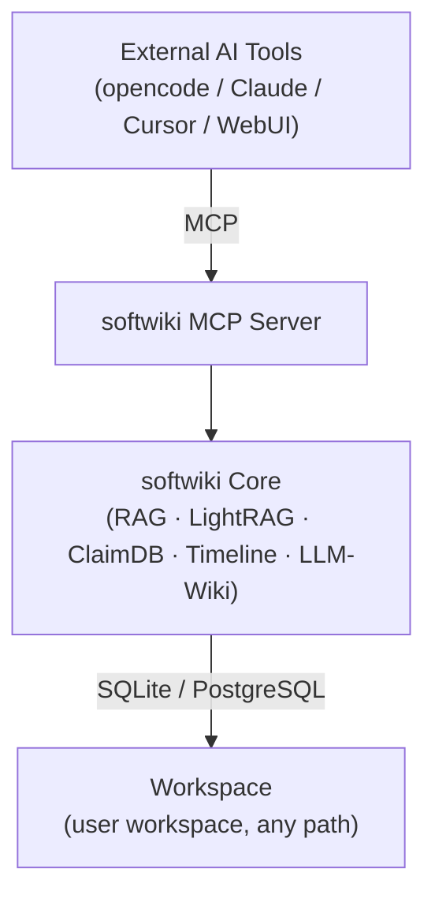

# Architecture Overview

> This document describes the overall architecture, subsystem boundaries, dependency relationships, and operating modes of softwiki.
> Implementation details are in [02-design/](../02-design/), operation guides in [03-operations/](../03-operations/), and roadmap in [05-roadmap/](../05-roadmap/).

---

## Project Positioning

**softwiki is a domain-independent research knowledge engine.**

Its core capabilities are: extracting structured knowledge (claims, graphs, timelines) from raw documents, and providing traceable answers to research questions through hybrid retrieval (Dense Vector + BM25) and LLM synthesis. All capabilities are exposed via **MCP (Model Context Protocol)**, allowing any MCP-compatible AI tool to connect.

**Non-positioning:**
- Not a general conversation engine (no multi-turn chat memory)
- Not a real-time collaboration platform (single-user, file-system isolated)
- Not a full-text search engine (retrieval is refined by LLM before output)

---

## Design Philosophy

| Principle | Meaning |
|-----------|---------|
| **Raw sources = canonical evidence** | Original documents are the sole authoritative source of knowledge. All extracted claims, graphs, and events must be traceable to a document ID. |
| **Core = knowledge-domain business logic only** | Core contains only knowledge-base business logic: ingestion, indexing, retrieval, extraction, synthesis. No UI rendering, agent decision loops, or external tool orchestration. |
| **MCP = formal capability boundary** | MCP is softwiki's formal external capability boundary. All external tools (opencode, Claude, Cursor, custom agents) access softwiki uniformly through the MCP protocol. CLI and WebUI also ultimately call Core + MCP. |
| **External tools own their agent loops** | External tools manage their own agent loops (planning, tool selection, error recovery). softwiki does not embed an agent framework; it exposes atomic MCP tools. |

---

## Three-Layer Architecture



### Layer 1: MCP Server (Capability Boundary)

- Path: `softwiki/mcp/server.py`
- Exposes **17 MCP tools** covering status queries, document ingestion, index rebuild, hybrid search, knowledge graph queries, claim queries, timeline queries, Wiki compilation, web search agent, etc.
- Implemented with `FastMCP` (`mcp` Python SDK), communicating via stdio JSON-RPC.
- Handles mode permission checks (`SOFTWIKI_MODE` environment variable); write operations are rejected in read-only modes.
- Contains no business logic — only parameter validation and permission checks before delegating to Core.

### Layer 2: Core (Knowledge Engine Core)

Contains the following subsystems:

| Subsystem | Directory | Function |
|-----------|-----------|----------|
| **Ingestion** | `softwiki/ingestion/` | Web page / PDF ingestion, cleaning, HTML sanitization, deduplication |
| **Source Store** | `softwiki/source_store/` | Data models (Document/Chunk/Claim/Entity/Relationship/Event), SQLAlchemy ORM, document CRUD |
| **RAG** | `softwiki/rag/` | Text chunking, embedding generation, dense vector storage, BM25 keyword index, hybrid search (RRF fusion), citation management |
| **Extraction** | `softwiki/extraction/` | Multi-dimensional knowledge extraction pipeline: Claim → Graph (Entity + Relationship) → Timeline (Event) |
| **Graph RAG** | `softwiki/graph_rag/` | LightRAG adapter providing multi-hop graph queries (local / global / hybrid / mix / naive) |
| **Intelligence** | `softwiki/intelligence/` | Answer engine (Hybrid Search + LLM synthesis), LLM client (multi-provider support), scope guard |
| **Wiki** | `softwiki/wiki/` | LLM-Wiki auto-compilation, generating cumulative Markdown knowledge pages by Topic ID |
| **CLI** | `softwiki/cli/` | Click command-line interface, including Shell TUI (opencode-driven interactive research assistant) |
| **API** | `softwiki/api/` | FastAPI RESTful API for WebUI consumption |

### Layer 3: Workspace

- A workspace is an **independent knowledge base at any path**, fully isolated.
- Internal structure:
  ```
  workspace/<name>/
    raw/               # Original files (HTML, PDF, Markdown, API responses)
    processed/         # Chunked text, embedding vectors, extraction results
    exports/           # Wiki page exports (topics/, claims/, reports/, etc.)
    config/            # Workspace configuration (sources.yaml, model_profiles.yaml, scope.md)
    .softwiki/         # Database files (SQLite / index files)
  ```
- Default workspace: `workspace/default`
- Supports PostgreSQL as a storage backend (config switch, no code changes).

---

## Subsystem Boundaries

| Module | Responsibility | External Interface | Key Route |
|--------|---------------|-------------------|-----------|
| `softwiki/mcp/` | MCP exposure layer | 17 MCP tools (stdio JSON-RPC) | `softwiki.mcp.server` |
| `softwiki/cli/` | Shell TUI | `./sw` command + opencode integration (MCP stdio) | `softwiki.cli.main:cli` |
| `softwiki/api/` | REST API | HTTP endpoints (`/api/ask`, `/api/ingest/*`, `/api/wiki/*`, etc.) | `softwiki.api.server:app` |
| `web/` | WebUI | Next.js 16 frontend consuming REST API | `web/app/` |
| `softwiki/core/` | — | Core is not exposed independently; accessed via MCP / API / CLI | — |

> **Note**: CLI and Shell TUI call Core through the **MCP stdio protocol**, not by directly importing Core modules.
> This ensures zero direct Python API dependency on Core, enforcing a unified entry point through the MCP layer.

---

## Dependency Direction

```
WebUI → REST API → Core
Shell  → MCP → Core
External Agent → MCP → Core
Core has zero dependency on any external tool.
```

Specific rules:

1. **WebUI (Next.js)** only calls REST API, never accesses Core directly.
2. **Shell TUI (opencode)** only calls Core via MCP stdio protocol, never imports any Core Python module.
3. **External AI tools** (Claude Desktop, Cursor, opencode main instance) only connect via MCP protocol.
4. **Core has zero external AI tool dependency**: all Core functionality can be used directly through CLI (`./sw`), no external AI tools needed.
5. **MCP Server runs independently**: `python -m softwiki.mcp.server` can run as a standalone process registered in any MCP host configuration.

---

## Operating Modes

softwiki defines four operating modes, controlled via `SOFTWIKI_MODE` environment variable or CLI `--mode` parameter:

| Mode | Alias | Permission Scope |
|------|-------|-----------------|
| `wiki-admin` | `admin` | All operations: ingest, index, extraction, Wiki compilation, admin commands |
| `wiki-manage` | `manage` | Ingest, rebuild index, Wiki publish (no workspace init/destroy) |
| `wiki-work` | `work` | Read-only retrieval + Wiki compilation + staging submission (writes to staging area, not directly to production data) |
| `wiki-study` | `study` | Read-only retrieval: Ask, Search, Graph Query, Timeline Query, Claim Query (no writes or Wiki compilation) |

Permission matrix:

| Operation | wiki-admin | wiki-manage | wiki-work | wiki-study |
|-----------|:----------:|:-----------:|:---------:|:----------:|
| ingest / init / index / delete documents | ✅ | ✅ | ❌ | ❌ |
| wiki build (compile) | ✅ | ✅ | ✅ | ❌ |
| ask / search / retrieve | ✅ | ✅ | ✅ | ✅ |
| graph / timeline / claim queries | ✅ | ✅ | ✅ | ✅ |
| wiki read (existing pages) | ✅ | ✅ | ✅ | ✅ |
| workspace initialization | ✅ | ❌ | ❌ | ❌ |

Mode is validated at **both MCP and API layers**: each write tool in `softwiki/mcp/server.py` checks `SOFTWIKI_MODE` at the start, and the API layer intercepts via `check_read_only()` middleware.

---

## Architecture Summary

1. **MCP is the sole capability boundary** — there is no second "private API" bypassing MCP. CLI `./sw shell` also goes through MCP stdio.
2. **Workspace equals knowledge base** — all data (documents, indexes, config, Wiki pages) is organized by filesystem path; copy equals backup.
3. **Modules are pluggable** — `ENABLED_MODULES` environment variable controls RAG / Graph / ClaimDB / Timeline / LLM-Wiki enablement.
4. **LLM and Embedding are independent** — LLM and Embedding can be configured with different providers (e.g., DeepSeek LLM + Gemini Embedding).
5. **External agents own their loops** — softwiki does not control external tool decision flows, only provides atomic tools.
