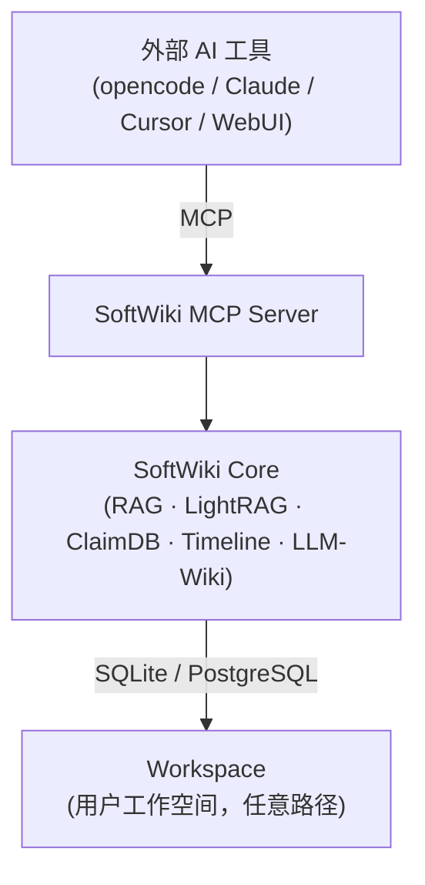

# 架构概览

> 本文档描述 SoftWiki 的整体架构设计、子系统边界、依赖关系和运行模式。
> 实现细节见 [02-design/](../02-design/)，操作指南见 [03-operations/](../03-operations/)，路线图见 [05-roadmap/](../05-roadmap/)。

---

## 项目定位

**SoftWiki 是一个领域无关的研究知识库引擎（Domain-Independent Research Knowledge Engine）。**

其核心能力是：从原始文档中提取结构化知识（声明、图谱、时间线），通过混合检索（Dense Vector + BM25）和 LLM 合成，为研究问题提供可溯源的回答。所有能力通过 **MCP（Model Context Protocol）** 暴露，允许任何 MCP 兼容的 AI 工具接入。

**非定位：**
- 不是通用对话引擎（无多轮聊天记忆）
- 不是实时协作平台（单人使用，文件系统隔离）
- 不是全文搜索引擎（检索后经 LLM 精炼输出）

---

## 设计哲学

| 原则 | 含义 |
|------|------|
| **Raw sources = canonical evidence** | 原始文档是知识的唯一权威来源。提取出的声明、图谱、事件都必须可溯源到文档 ID。 |
| **Core = knowledge-domain business logic only** | Core 层仅包含知识库领域的业务逻辑：摄入、索引、检索、抽取、合成。不包含 UI 渲染、Agent 决策循环、外部工具协调。 |
| **MCP = formal capability boundary** | MCP 是 SoftWiki 对外的正式能力边界。所有外部工具（opencode、Claude、Cursor、自定义 Agent）统一通过 MCP 协议访问。CLI 和 WebUI 也最终调用 Core + MCP。 |
| **External tools own their agent loops** | 外部工具自己管理 Agent 循环（planning、tool selection、error recovery）。SoftWiki 不内嵌 Agent 框架，暴露原子化的 MCP tools。 |

---

## 三层架构



### 第一层：MCP Server（能力边界层）

- 路径：`softwiki/mcp/server.py`
- 对外暴露 **17 个 MCP tools**，涵盖状态查询、文档摄入、索引重建、混合检索、知识图谱查询、声明查询、时间线查询、Wiki 编译、网络搜索代理等。
- 使用 `FastMCP`（`mcp` Python SDK）实现，通信协议为 stdio JSON-RPC。
- 负责模式权限校验（`SOFTWIKI_MODE` 环境变量），写操作在只读模式下被拒绝。
- 不包含业务逻辑——仅做参数校验、权限检查后委托 Core 执行。

### 第二层：Core（知识引擎核心层）

包含以下子系统：

| 子系统 | 目录 | 功能 |
|--------|------|------|
| **Ingestion** | `softwiki/ingestion/` | Web 页面 / PDF 文件摄入、清洗、HTML 净化、去重 |
| **Source Store** | `softwiki/source_store/` | 数据模型（Document/Chunk/Claim/Entity/Relationship/Event）、SQLAlchemy ORM、文档 CRUD |
| **RAG** | `softwiki/rag/` | 文本分块、Embedding 生成、Dense Vector 存储、BM25 关键字索引、Hybrid Search（RRF 融合）、引文管理 |
| **Extraction** | `softwiki/extraction/` | 多维知识抽取 Pipeline：声明（Claim）→ 图谱（Entity + Relationship）→ 时间线（Event） |
| **Graph RAG** | `softwiki/graph_rag/` | LightRAG 适配器，提供知识图谱的多跳推理查询（local / global / hybrid / mix / naive） |
| **Intelligence** | `softwiki/intelligence/` | 答案引擎（Hybrid Search + LLM 合成）、LLM 客户端（多 Provider 支持）、作用域守卫 |
| **Wiki** | `softwiki/wiki/` | LLM-Wiki 自动编译，根据 Topic ID 生成累积式 Markdown 知识页面 |
| **CLI** | `softwiki/cli/` | Click 命令行入口，包含 Shell TUI（opencode 驱动的交互式研究助手） |
| **API** | `softwiki/api/` | FastAPI RESTful API，供 WebUI 调用 |

### 第三层：Workspace（工作空间）

- 工作空间是 **任意路径下的独立知识库**，完全隔离。
- 内部结构：
  ```
  workspace/<name>/
    raw/               # 原始文件（HTML, PDF, Markdown, API 响应）
    processed/         # 分块文本、Embedding 向量、抽取结果
    exports/           # Wiki 页面导出（topics/, claims/, reports/ 等）
    config/            # 工作空间配置（sources.yaml, model_profiles.yaml, scope.md）
    .softwiki/         # 数据库文件（SQLite / 索引文件）
  ```
- 默认工作空间：`workspace/default`
- 支持 PostgreSQL 作为存储后端（配置切换，无需代码改动）。

---

## 子系统边界

| 模块 | 职责 | 对外接口 | 关键路由 |
|------|------|---------|---------|
| `softwiki/mcp/` | MCP 暴露层 | 17 个 MCP tools（stdio JSON-RPC） | `softwiki.mcp.server` |
| `softwiki/cli/` | Shell TUI | `./sw` 命令 + opencode 集成（MCP stdio） | `softwiki.cli.main:cli` |
| `softwiki/api/` | REST API | HTTP endpoints (`/api/ask`, `/api/ingest/*`, `/api/wiki/*` 等) | `softwiki.api.server:app` |
| `web/` | WebUI | Next.js 16 前端，消费 REST API | `web/app/` |
| `softwiki/core/` | — | Core 内部不单独暴露，通过 MCP / API / CLI 访问 | — |

> **注意**：CLI 和 Shell TUI 内部通过 **MCP stdio 协议** 调用 Core，而非直接 import Core 模块。
> 这是为了确保 CLI 对 Core 的 Python API 零直接依赖，强制所有入口统一通过 MCP 层。

---

## 依赖方向

```
WebUI → REST API → Core
Shell  → MCP → Core
外部 Agent → MCP → Core
Core 对任何外部工具零依赖。
```

具体规则：

1. **WebUI（Next.js）** 只调用 REST API，不直接访问 Core。
2. **Shell TUI（opencode）** 只通过 MCP stdio 协议调用 Core，不 import 任何 Core Python 模块。
3. **外部 AI 工具**（Claude Desktop、Cursor、opencode 主实例）只通过 MCP 协议连接。
4. **Core 零外部 AI 工具依赖**：Core 的所有功能都可以通过 CLI (`./sw`) 直接使用，无需外部 AI 工具介入。
5. **MCP Server 可独立运行**：`python -m softwiki.mcp.server` 可作为独立进程注册到任何 MCP 主机的配置中。

---

## 运行模式

SoftWiki 定义了四种运行模式，通过 `SOFTWIKI_MODE` 环境变量或 CLI `--mode` 参数控制：

| 模式 | 别名 | 权限范围 |
|------|------|---------|
| `wiki-admin` | `admin` | 全部操作：摄入、索引、抽取、Wiki 编译、管理命令 |
| `wiki-manage` | `manage` | 摄入、重建索引、Wiki 发布（不含工作空间初始化/销毁） |
| `wiki-work` | `work` | 只读检索 + Wiki 编译 + staging 提交（写入 staging 区域但不直接修改生产数据） |
| `wiki-study` | `study` | 只读检索：Ask、Search、Graph Query、Timeline Query、Claim Query（禁用任何写入和 Wiki 编译） |

权限矩阵：

| 操作 | wiki-admin | wiki-manage | wiki-work | wiki-study |
|------|:----------:|:-----------:|:---------:|:----------:|
| ingest / init / index / 删除文档 | ✅ | ✅ | ❌ | ❌ |
| wiki build（编译） | ✅ | ✅ | ✅ | ❌ |
| ask / search / retrieve | ✅ | ✅ | ✅ | ✅ |
| graph / timeline / claim 查询 | ✅ | ✅ | ✅ | ✅ |
| wiki read（读取已有页面） | ✅ | ✅ | ✅ | ✅ |
| 工作空间初始化 | ✅ | ❌ | ❌ | ❌ |

模式在 **MCP 层和 API 层** 双重校验：`softwiki/mcp/server.py` 中每个写入 tool 开头检查 `SOFTWIKI_MODE`，API 层通过 `check_read_only()` 中间件拦截。

---

## 架构要点总结

1. **MCP 是唯一能力边界**——没有第二个"私有 API"绕开 MCP。CLI `./sw shell` 也走 MCP stdio。
2. **工作空间即知识库**——一切数据（文档、索引、配置、Wiki 页面）以文件系统路径组织，复制即备份。
3. **模块可插拔**——`ENABLED_MODULES` 环境变量控制 RAG / Graph / ClaimDB / Timeline / LLM-Wiki 的启用状态。
4. **LLM 与 Embedding 无关**——LLM 和 Embedding 可独立配置不同的 Provider（如 DeepSeek LLM + Gemini Embedding）。
5. **外部 Agent 自有循环**——SoftWiki 不接管外部工具的决策流程，只提供原子化工具。
