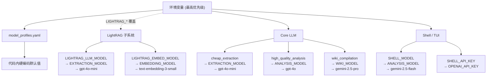

# 配置系统参考

## 环境变量完整参考

SoftWiki 的配置通过环境变量驱动。加载顺序为：

1. 进程已有的环境变量（最高优先级）
2. `.env` 文件（自动从 `$CWD/.env` 或项目根目录 `.env` 加载，仅当环境变量尚未设置时生效）
3. 代码内硬编码默认值（最低优先级）

> **注意**：`.env` 文件中的 `export` 或引号可选——`config.py` 的 `load_env()` 会自动去除首尾引号。

### 工作区 (Workspace)

| 变量 | 类型 | 默认值 | 回退链 | 说明 |
|---|---|---|---|---|
| `WORKSPACE_DIR` | `string` | `workspace/default` | — | 当前工作区目录（绝对或相对路径），包含 `config/`、`.softwiki/`、`raw/`、`exports/` 子目录 |
| `SOFTWIKI_MODE` | `string` | `wiki-admin` | — | 运行模式：`wiki-admin`、`wiki-manage`、`wiki-work`、`wiki-study`、`wiki-user` 或短别名 `study`、`work`、`user`。控制 MCP 工具的读写权限和 shell 行为 |
| `SOFTWIKI_SESSION_ID` | `string` | `default`（非交互模式）或自动生成 `session-{8位随机}` | — | 当前会话标识。当 `SOFTWIKI_MODE` 为 `wiki-study` / `wiki-work` / `wiki-user` / `study` / `work` / `user` 时若未设置则自动生成 |
| `SOFTWIKI_SESSION_SUFFIX` | `string` | `null` | — | 会话后缀（仅用于 shell 显示，不影响逻辑） |
| `SOFTWIKI_ENABLE_WEB_SEARCH` | `string` | _(空字符串)_ | — | 设为 `1`、`true` 或 `yes` 启用服务端 `softwiki_web_search` MCP 工具（默认关闭，仅影响通过 MCP 的外部代理调用） |

### 核心 LLM (Core LLM)

由 `softwiki/intelligence/llm_client.py` 读取，配合 `model_profiles.yaml` 使用。

| 变量 | 类型 | 默认值 | 回退链 | 说明 |
|---|---|---|---|---|
| `OPENAI_API_KEY` | `string` | — | — | OpenAI 兼容 API 密钥。所有非 Ollama 提供商的最终回退目标 |
| `OPENAI_API_BASE` | `string` | — | — | OpenAI 兼容 API 基础 URL。适用于代理、DeepSeek、Groq、Gemini 等 |
| `EXTRACTION_MODEL` | `string` | `gpt-4o-mini` | — | 实体抽取/低成本的默认模型名（profile `cheap_extraction` 未设置 `model` 时使用） |
| `ANALYSIS_MODEL` | `string` | `gpt-4o` | — | 高质量分析的默认模型名（profile `high_quality_analysis` 未设置 `model` 时使用） |
| `WIKI_MODEL` | `string` | `gemini-2.5-pro` | — | 维基页面编译的默认模型名（profile `wiki_compilation` 未设置 `model` 时使用） |
| `GEMINI_API_KEY` | `string` | — | → `OPENAI_API_KEY` | 当 `provider` 为 `gemini` 或 `google` 时使用。若未设置则回退到 `OPENAI_API_KEY` |
| `OLLAMA_API_BASE` | `string` | `http://localhost:11434/v1` | — | 当 `provider` 为 `ollama` 时使用。若未设置则使用默认本地地址 |

### Shell / TUI 模型 (Shell Model)

独立于 Core LLM，仅由 `softwiki/cli/shell.py` 用于配置 opencode 代理。

| 变量 | 类型 | 默认值 | 回退链 | 说明 |
|---|---|---|---|---|
| `SHELL_MODEL` | `string` | `gemini-2.5-flash` | `ANALYSIS_MODEL` → `gemini-2.5-flash` | Shell（opencode）代理的模型。若设置则覆盖 Core LLM 的分析模型 |
| `SHELL_API_BASE` | `string` | `https://generativelanguage.googleapis.com/v1beta/` | `OPENAI_API_BASE` → `https://generativelanguage.googleapis.com/v1beta/` | Shell 代理的 API 基础 URL。允许 Shell 与 Core LLM 使用不同端点 |
| `SHELL_API_KEY` | `string` | — | → `OPENAI_API_KEY` | Shell 代理的 API 密钥。若未设置则使用 `OPENAI_API_KEY` |

### 嵌入 (Embedding)

| 变量 | 类型 | 默认值 | 回退链 | 说明 |
|---|---|---|---|---|
| `EMBEDDING_PROVIDER` | `string` | `openai` | — | 嵌入提供商：`openai`（OpenAI API）或 `local`（本地 sentence-transformers 或基于 TF-IDF 的回退） |
| `EMBEDDING_MODEL` | `string` | `text-embedding-3-small` | — | 嵌入模型名 |

### LightRAG — LLM

LightRAG 图数据库的 LLM 配置，独立于 Core LLM。

| 变量 | 类型 | 默认值 | 回退链 | 说明 |
|---|---|---|---|---|
| `LIGHTRAG_LLM_API_KEY` | `string` | — | → `OPENAI_API_KEY` | LightRAG 专用的 API 密钥。若设置则完全独立于 Core LLM |
| `LIGHTRAG_LLM_API_BASE` | `string` | `https://api.openai.com/v1` | `OPENAI_API_BASE` → `https://api.openai.com/v1` | LightRAG 专用的 API 基础 URL |
| `LIGHTRAG_LLM_MODEL` | `string` | `gpt-4o-mini` | `EXTRACTION_MODEL` → `gpt-4o-mini` | LightRAG 实体抽取 + 查询合成的模型 |

### LightRAG — 嵌入 (Embedding)

| 变量 | 类型 | 默认值 | 回退链 | 说明 |
|---|---|---|---|---|
| `LIGHTRAG_EMBED_PROVIDER` | `string` | `openai` | `EMBEDDING_PROVIDER` → `openai` | LightRAG 专用的嵌入提供商 |
| `LIGHTRAG_EMBED_API_KEY` | `string` | — | → `OPENAI_API_KEY` | LightRAG 专用的嵌入 API 密钥 |
| `LIGHTRAG_EMBED_API_BASE` | `string` | `https://api.openai.com/v1` | `OPENAI_API_BASE` → `https://api.openai.com/v1` | LightRAG 专用的嵌入 API 基础 URL |
| `LIGHTRAG_EMBED_MODEL` | `string` | `text-embedding-3-small` | `EMBEDDING_MODEL` → `text-embedding-3-small` | LightRAG 专用的嵌入模型 |
| `LIGHTRAG_EMBED_DIM` | `int` | 自动检测 | 内置 `KNOWN_EMBED_DIMS` 映射 → `1536` | 嵌入向量维度。若未设置则根据模型名从内置查找表中自动匹配 |

**内建维度查找表**（`softwiki/graph_rag/adapter.py` 中的 `KNOWN_EMBED_DIMS`）：

| 模型 | 维度 |
|---|---|
| `text-embedding-3-small` | 1536 |
| `text-embedding-3-large` | 3072 |
| `text-embedding-ada-002` | 1536 |
| `text-embedding-004` | 768 |
| `models/embedding-001` | 768 |
| `deepseek-embedding` | 2048 |
| `bge-m3` | 1024 |
| `bge-small-zh-v1.5` | 512 |
| `all-MiniLM-L6-v2` | 384 |
| _未知模型_ | 1536（回退） |

### LightRAG — 存储 (Storage)

| 变量 | 类型 | 默认值 | 回退链 | 说明 |
|---|---|---|---|---|
| `LIGHTRAG_STORAGE` | `string` | `json` | — | 存储后端：`json`（零配置，文件存储）或 `postgres` |
| `LIGHTRAG_PG_URL` | `string` | `postgresql://localhost:5432/softwiki` | — | PostgreSQL 连接字符串（仅当 `LIGHTRAG_STORAGE=postgres` 时使用） |

### 服务端 Web 搜索 (Server Web Search)

由 `softwiki_web_search` MCP 工具使用。仅在 `SOFTWIKI_ENABLE_WEB_SEARCH=true` 时激活。提供商按优先级尝试：Tavily → SerpAPI → Bing。

| 变量 | 类型 | 默认值 | 回退链 | 说明 |
|---|---|---|---|---|
| `TAVILY_API_KEY` | `string` | — | — | Tavily API 密钥（推荐，AI 原生搜索，每月 1000 次免费查询） |
| `SERPAPI_KEY` | `string` | — | — | SerpAPI 密钥（Google/Bing/Baidu 等，每月 100 次免费查询） |
| `BING_SEARCH_API_KEY` | `string` | — | — | Azure 必应搜索 API 密钥（Azure Cognitive Services，每月 1000 次免费查询） |

### Shell 客户端 Web 搜索 (Shell Client-side Web Search)

由 `softwiki/cli/shell.py` 传递给 opencode 配置。不经过 SoftWiki 服务端。

| 变量 | 类型 | 默认值 | 回退链 | 说明 |
|---|---|---|---|---|
| `EXA_API_KEY` | `string` | — | — | Exa API 密钥（exa.ai，每月 1000 次免费查询。优先级最高） |
| `TAVILY_API_KEY` | `string` | — | — | Tavily API 密钥（优先级次之） |

> Shell 客户端搜索默认使用 DuckDuckGo（免费，无需密钥）。`EXA_API_KEY` 和 `TAVILY_API_KEY` 是可选的增强选项。

### 特性开关 (Feature Flags)

| 变量 | 类型 | 默认值 | 回退链 | 说明 |
|---|---|---|---|---|
| `ENABLED_MODULES` | `string`（逗号分隔） | `rag,graph,claimdb,timeline,llmwiki` | — | 启用的知识处理模块列表。可用值：`rag`、`graph`、`claimdb`、`timeline`、`llmwiki`。逗号分隔，大小写不敏感 |

---

## 配置分辨率优先级

SoftWiki 采用三层分辨率策略。环境变量的查找顺序为：

```
LIGHTRAG_* 专用变量              ← 最高优先级（仅影响 LightRAG 子系统）
  → 通用环境变量                 ← 中间优先级（Core LLM 与 Shell 共享）
    → model_profiles.yaml         ← YAML 内定义
      → 代码内硬编码默认值        ← 最低保障
```

### 具体链示例

```
LIGHTRAG_LLM_API_KEY
  → OPENAI_API_KEY
    → (无进一步回退，缺失则 LLM 不可用)

LIGHTRAG_LLM_MODEL
  → EXTRACTION_MODEL
    → "gpt-4o-mini"

LIGHTRAG_EMBED_DIM
  → KNOWN_EMBED_DIMS[model]（内建查找表）
    → 1536

SHELL_MODEL
  → ANALYSIS_MODEL
    → "gemini-2.5-flash"
```

### LLM 客户端最终参数

对于每个 `profile_name`（`cheap_extraction`、`high_quality_analysis`、`wiki_compilation`），最终参数解析为：

```
model_name = profile.model  ??  env(对应_MODEL)  ??  硬编码默认
api_key    = provider 对应密钥               ??  OPENAI_API_KEY
base_url   = provider 对应 base_url          ??  OPENAI_API_BASE  ??  默认 API URL
```

---

## model_profiles.yaml 格式

`model_profiles.yaml` 位于工作区的 `config/` 目录下（`{WORKSPACE_DIR}/config/model_profiles.yaml`），默认模板在 `softwiki/templates/model_profiles.yaml`。

用户可覆盖整个文件，系统加载时若文件不存在或解析失败则回退到环境变量 + 硬编码默认值。

### 结构

```yaml
profiles:
  # ── 嵌入 (Embedding) ──
  local_embedding:
    provider: local           # "openai" | "local" | "gemini"/"google" | "ollama"
    model: bge-m3             # 嵌入模型名

  # ── 低成本实体抽取 ──
  cheap_extraction:
    provider: openai
    model: gpt-4o-mini        # 未设置时回退到 EXTRACTION_MODEL → "gpt-4o-mini"
    temperature: 0.0          # 可选，默认 0.0
    # max_tokens: 2048        # 可选，不设则使用 OpenAI SDK 默认值

  # ── 高质量分析推理 ──
  high_quality_analysis:
    provider: openai
    model: gpt-4o             # 未设置时回退到 ANALYSIS_MODEL → "gpt-4o"
    temperature: 0.2

  # ── 维基页面编译 ──
  wiki_compilation:
    provider: openai
    model: gemini-2.5-pro     # 未设置时回退到 WIKI_MODEL → "gemini-2.5-pro"
    temperature: 0.2
```

### 字段说明

| 字段 | 类型 | 默认值 | 说明 |
|---|---|---|---|
| `provider` | `string` | `openai` | API 提供商：`openai`、`gemini`/`google`、`ollama`、`local`（仅嵌入）。决定 API 密钥和 base URL 的解析方式 |
| `model` | `string` | 见上方各 profile | 模型标识符。若未设置则回退到对应的环境变量 |
| `temperature` | `float` | `0.0` | 生成温度（0.0–2.0） |
| `max_tokens` | `int` | 不设（SDK 默认） | 每次响应的最大 token 数 |
| `api_base` | `string` | `provider` 对应默认值 | **仅在 `ollama` 提供商时支持**。覆盖 API 基础 URL |

### Provider 密钥解析规则

| provider | API 密钥来源 | API Base 来源 |
|---|---|---|
| `openai` | `OPENAI_API_KEY` | `OPENAI_API_BASE`（可空） |
| `gemini` / `google` | `GEMINI_API_KEY` → `OPENAI_API_KEY` | `OPENAI_API_BASE` → `https://generativelanguage.googleapis.com/v1beta/` |
| `ollama` | `ollama`（固定占位符） | `profile.api_base` → `OLLAMA_API_BASE` → `http://localhost:11434/v1` |
| `local` | 无需密钥 | 无需端点 |

### 工作区覆盖

工作区可在 `{WORKSPACE_DIR}/config/model_profiles.yaml` 中定义自定义 profile，或覆盖默认 profile 的参数。系统加载时会优先读取工作区文件；若文件不存在或解析失败，则完全使用环境变量 + 硬编码默认值。

### 子项 mermaid 图


