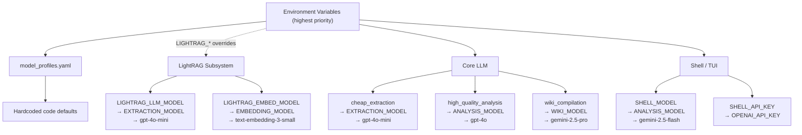

# Configuration System Reference

## Environment Variable Reference

softwiki's configuration is driven by environment variables. The loading order is:

1. Existing process environment variables (highest priority)
2. `.env` file (auto-loaded from `$CWD/.env` or project root `.env`, only takes effect when the variable is not already set)
3. Hardcoded defaults in code (lowest priority)

> **Note**: `export` and quotes in `.env` files are optional — `config.py`'s `load_env()` automatically strips surrounding quotes.

### Workspace

| Variable | Type | Default | Fallback Chain | Description |
|---|---|---|---|---|
| `WORKSPACE_DIR` | `string` | `workspace/default` | — | Current workspace directory (absolute or relative path), containing `config/`, `.softwiki/`, `raw/`, `exports/` subdirectories |
| `SOFTWIKI_MODE` | `string` | `wiki-admin` | — | Operating mode: `wiki-admin`, `wiki-manage`, `wiki-work`, `wiki-study` or short aliases `study`, `work`. Controls MCP tool read/write permissions and shell behavior |
| `SOFTWIKI_SESSION_ID` | `string` | `default` (non-interactive) or auto-generated `session-{8-char random}` | — | Current session ID. Auto-generated when `SOFTWIKI_MODE` is `wiki-study` / `wiki-work` / `study` / `work` and not already set |
| `SOFTWIKI_SESSION_SUFFIX` | `string` | `null` | — | Session suffix (for shell display only, no logic impact) |
| `SOFTWIKI_ENABLE_WEB_SEARCH` | `string` | _(empty)_ | — | Set to `1`, `true` or `yes` to enable the server-side `softwiki_web_search` MCP tool (default off, only affects external agent calls via MCP) |

### Core LLM

Read by `softwiki/intelligence/llm_client.py`, used with `model_profiles.yaml`.

| Variable | Type | Default | Fallback Chain | Description |
|---|---|---|---|---|
| `OPENAI_API_KEY` | `string` | — | — | OpenAI-compatible API key. Final fallback for all non-Ollama providers |
| `OPENAI_API_BASE` | `string` | — | — | OpenAI-compatible API base URL. Works with proxies, DeepSeek, Groq, Gemini, etc. |
| `EXTRACTION_MODEL` | `string` | `gpt-4o-mini` | — | Default model for entity extraction / low-cost tasks (used when profile `cheap_extraction` has no `model` set) |
| `ANALYSIS_MODEL` | `string` | `gpt-4o` | — | Default model for high-quality analysis (used when profile `high_quality_analysis` has no `model` set) |
| `WIKI_MODEL` | `string` | `gemini-2.5-pro` | — | Default model for wiki page compilation (used when profile `wiki_compilation` has no `model` set) |
| `GEMINI_API_KEY` | `string` | — | → `OPENAI_API_KEY` | Used when `provider` is `gemini` or `google`. Falls back to `OPENAI_API_KEY` if not set |
| `OLLAMA_API_BASE` | `string` | `http://localhost:11434/v1` | — | Used when `provider` is `ollama`. Falls back to default local address if not set |

### Shell / TUI Model

Independent from Core LLM, only used by `softwiki/cli/shell.py` for opencode agent configuration.

| Variable | Type | Default | Fallback Chain | Description |
|---|---|---|---|---|
| `SHELL_MODEL` | `string` | `gemini-2.5-flash` | `ANALYSIS_MODEL` → `gemini-2.5-flash` | Model for Shell (opencode) agent. Overrides Core LLM analysis model if set |
| `SHELL_API_BASE` | `string` | `https://generativelanguage.googleapis.com/v1beta/` | `OPENAI_API_BASE` → `https://generativelanguage.googleapis.com/v1beta/` | API base URL for Shell agent. Allows Shell to use different endpoints from Core LLM |
| `SHELL_API_KEY` | `string` | — | → `OPENAI_API_KEY` | API key for Shell agent. Uses `OPENAI_API_KEY` if not set |

### Embedding

| Variable | Type | Default | Fallback Chain | Description |
|---|---|---|---|---|
| `EMBEDDING_PROVIDER` | `string` | `openai` | — | Embedding provider: `openai` (OpenAI API) or `local` (local sentence-transformers or TF-IDF fallback) |
| `EMBEDDING_MODEL` | `string` | `text-embedding-3-small` | — | Embedding model name |

### LightRAG — LLM

LightRAG graph database LLM configuration, independent from Core LLM.

| Variable | Type | Default | Fallback Chain | Description |
|---|---|---|---|---|
| `LIGHTRAG_LLM_API_KEY` | `string` | — | → `OPENAI_API_KEY` | LightRAG-specific API key. Completely independent from Core LLM if set |
| `LIGHTRAG_LLM_API_BASE` | `string` | `https://api.openai.com/v1` | `OPENAI_API_BASE` → `https://api.openai.com/v1` | LightRAG-specific API base URL |
| `LIGHTRAG_LLM_MODEL` | `string` | `gpt-4o-mini` | `EXTRACTION_MODEL` → `gpt-4o-mini` | Model for LightRAG entity extraction + query synthesis |

### LightRAG — Embedding

| Variable | Type | Default | Fallback Chain | Description |
|---|---|---|---|---|
| `LIGHTRAG_EMBED_PROVIDER` | `string` | `openai` | `EMBEDDING_PROVIDER` → `openai` | LightRAG-specific embedding provider |
| `LIGHTRAG_EMBED_API_KEY` | `string` | — | → `OPENAI_API_KEY` | LightRAG-specific embedding API key |
| `LIGHTRAG_EMBED_API_BASE` | `string` | `https://api.openai.com/v1` | `OPENAI_API_BASE` → `https://api.openai.com/v1` | LightRAG-specific embedding API base URL |
| `LIGHTRAG_EMBED_MODEL` | `string` | `text-embedding-3-small` | `EMBEDDING_MODEL` → `text-embedding-3-small` | LightRAG-specific embedding model |
| `LIGHTRAG_EMBED_DIM` | `int` | Auto-detect | Built-in `KNOWN_EMBED_DIMS` mapping → `1536` | Embedding vector dimension. Auto-matched from built-in lookup table by model name if not set |

**Built-in dimension lookup table** (`KNOWN_EMBED_DIMS` in `softwiki/graph_rag/adapter.py`):

| Model | Dimension |
|---|---|
| `text-embedding-3-small` | 1536 |
| `text-embedding-3-large` | 3072 |
| `text-embedding-ada-002` | 1536 |
| `text-embedding-004` | 768 |
| `models/embedding-001` | 768 |
| `deepseek-embedding` | 2048 |
| `bge-m3` | 1024 |
| `bge-small-zh-v1.5` | 512 |
| `all-MiniLM-L6-v2` | 384 |
| _Unknown model_ | 1536 (fallback) |

### LightRAG — Storage

| Variable | Type | Default | Fallback Chain | Description |
|---|---|---|---|---|
| `LIGHTRAG_STORAGE` | `string` | `json` | — | Storage backend: `json` (zero-config, file storage) or `postgres` |
| `LIGHTRAG_PG_URL` | `string` | `postgresql://localhost:5432/softwiki` | — | PostgreSQL connection string (only used when `LIGHTRAG_STORAGE=postgres`) |

### Server Web Search

Used by the `softwiki_web_search` MCP tool. Only active when `SOFTWIKI_ENABLE_WEB_SEARCH=true`. Providers prioritized: Tavily → SerpAPI → Bing.

| Variable | Type | Default | Fallback Chain | Description |
|---|---|---|---|---|
| `TAVILY_API_KEY` | `string` | — | — | Tavily API key (recommended, AI-native search, 1000 free queries/month) |
| `SERPAPI_KEY` | `string` | — | — | SerpAPI key (Google/Bing/Baidu, 100 free queries/month) |
| `BING_SEARCH_API_KEY` | `string` | — | — | Azure Bing Search API key (Azure Cognitive Services, 1000 free queries/month) |

### Shell Client-side Web Search

Passed by `softwiki/cli/shell.py` to opencode configuration. Does not go through the softwiki server.

| Variable | Type | Default | Fallback Chain | Description |
|---|---|---|---|---|
| `EXA_API_KEY` | `string` | — | — | Exa API key (exa.ai, 1000 free queries/month. Highest priority) |
| `TAVILY_API_KEY` | `string` | — | — | Tavily API key (second priority) |

> Shell client-side search defaults to DuckDuckGo (free, no API key). `EXA_API_KEY` and `TAVILY_API_KEY` are optional enhancements.

### Feature Flags

| Variable | Type | Default | Fallback Chain | Description |
|---|---|---|---|---|
| `ENABLED_MODULES` | `string` (comma-separated) | `rag,graph,claimdb,timeline,llmwiki` | — | List of enabled knowledge processing modules. Valid values: `rag`, `graph`, `claimdb`, `timeline`, `llmwiki`. Comma-separated, case-insensitive |

---

## Configuration Resolution Priority

softwiki uses a three-tier resolution strategy. Environment variables are looked up in this order:

```
LIGHTRAG_* dedicated variables     ← Highest priority (only affects LightRAG subsystem)
  → General environment variables  ← Mid priority (shared by Core LLM and Shell)
    → model_profiles.yaml          ← YAML-defined
      → Hardcoded code defaults    ← Lowest guarantee
```

### Specific Fallback Chains

```
LIGHTRAG_LLM_API_KEY
  → OPENAI_API_KEY
    → (no further fallback, LLM unavailable if missing)

LIGHTRAG_LLM_MODEL
  → EXTRACTION_MODEL
    → "gpt-4o-mini"

LIGHTRAG_EMBED_DIM
  → KNOWN_EMBED_DIMS[model] (built-in lookup table)
    → 1536

SHELL_MODEL
  → ANALYSIS_MODEL
    → "gemini-2.5-flash"
```

### LLM Client Final Parameters

For each `profile_name` (`cheap_extraction`, `high_quality_analysis`, `wiki_compilation`), the final parameters resolve to:

```
model_name = profile.model  ??  env(corresponding_MODEL)  ??  hardcoded default
api_key    = provider-specific key                ??  OPENAI_API_KEY
base_url   = provider-specific base_url           ??  OPENAI_API_BASE  ??  default API URL
```

---

## model_profiles.yaml Format

`model_profiles.yaml` lives in the workspace `config/` directory (`{WORKSPACE_DIR}/config/model_profiles.yaml`), with a default template at `softwiki/templates/model_profiles.yaml`.

Users can override the entire file. If the file does not exist or fails to parse, the system falls back to environment variables + hardcoded defaults.

### Structure

```yaml
profiles:
  # ── Embedding ──
  local_embedding:
    provider: local           # "openai" | "local" | "gemini"/"google" | "ollama"
    model: bge-m3             # Embedding model name

  # ── Low-cost entity extraction ──
  cheap_extraction:
    provider: openai
    model: gpt-4o-mini        # Falls back to EXTRACTION_MODEL → "gpt-4o-mini" if not set
    temperature: 0.0          # Optional, default 0.0
    # max_tokens: 2048        # Optional, uses OpenAI SDK default if not set

  # ── High-quality analysis ──
  high_quality_analysis:
    provider: openai
    model: gpt-4o             # Falls back to ANALYSIS_MODEL → "gpt-4o" if not set
    temperature: 0.2

  # ── Wiki page compilation ──
  wiki_compilation:
    provider: openai
    model: gemini-2.5-pro     # Falls back to WIKI_MODEL → "gemini-2.5-pro" if not set
    temperature: 0.2
```

### Field Descriptions

| Field | Type | Default | Description |
|---|---|---|---|
| `provider` | `string` | `openai` | API provider: `openai`, `gemini`/`google`, `ollama`, `local` (embedding only). Determines API key and base URL resolution |
| `model` | `string` | See per-profile | Model identifier. Falls back to corresponding environment variable if not set |
| `temperature` | `float` | `0.0` | Generation temperature (0.0–2.0) |
| `max_tokens` | `int` | Not set (SDK default) | Maximum tokens per response |
| `api_base` | `string` | Provider default | **Only supported for `ollama` provider**. Overrides API base URL |

### Provider Key Resolution Rules

| provider | API Key Source | API Base Source |
|---|---|---|
| `openai` | `OPENAI_API_KEY` | `OPENAI_API_BASE` (can be empty) |
| `gemini` / `google` | `GEMINI_API_KEY` → `OPENAI_API_KEY` | `OPENAI_API_BASE` → `https://generativelanguage.googleapis.com/v1beta/` |
| `ollama` | `ollama` (fixed placeholder) | `profile.api_base` → `OLLAMA_API_BASE` → `http://localhost:11434/v1` |
| `local` | No key needed | No endpoint needed |

### Workspace Override

Workspaces can define custom profiles or override default profile parameters in `{WORKSPACE_DIR}/config/model_profiles.yaml`. The system reads the workspace file first; if it does not exist or fails to parse, it falls back entirely to environment variables + hardcoded defaults.

### Resolution Mermaid Diagram


