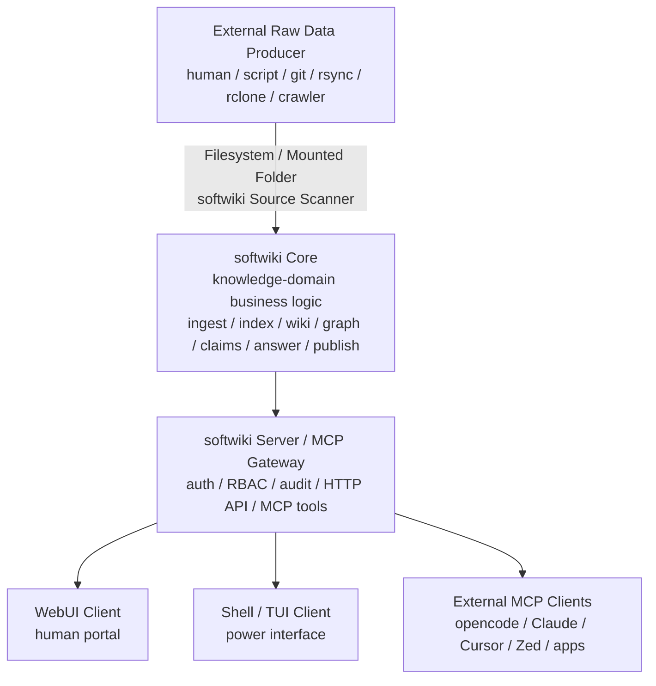

> [!NOTE]
> **This document is for reference only, not a design requirement.**
> It records architectural discussions and design thinking. Some content may exceed the current implementation scope.
> The actual code implementation takes precedence; see [project-status.md](project-status.md) for current status.

# softwiki Core External Architecture Summary

## 1. Document Scope

This document describes the architectural boundaries between softwiki Core and its external systems.

softwiki Core already exists and can handle knowledge-base business logic. This document does not redesign the internal RAG, GraphRAG, LLM-Wiki, synthesizer, index, graph, etc. implementations within Core.

This document focuses on:

* Responsibility boundaries between Core and external tools
* Sub-project decomposition
* MCP service exposure methods
* Remote MCP access
* WebUI positioning
* Shell / TUI positioning
* External client tools
* Raw data input boundary
* Filesystem-based source model
* Token and permission model
* Team deployment approach

---

# 2. Core Principles

softwiki Core is not a dumb backend.
softwiki Core should be responsible for business logic within the knowledge base domain.

But softwiki Core should not become a general-purpose Agent platform.

The correct boundary is:

```text
softwiki Core = knowledge-domain business logic
External Tools = user-facing / cross-domain agent workflow
MCP = capability boundary
Filesystem = raw data boundary
```

---

# 3. What softwiki Core Should Handle

Core can and should handle knowledge-base business logic, including:

```text
source scan
metadata / hash / dedup
ingest
chunk / index
RAG / Graph / Wiki / Claims / Timeline build
wiki generation
claim extraction
conflict detection
freshness detection
answer synthesis
citation / provenance
eval
publish / rollback
workspace status
```

These are within the knowledge base domain and should not be left to external agents to assemble on the fly.

Core can use LLM-powered internal workflow / internal agent to complete domain tasks, such as:

```text
contextual chunking
entity extraction
relation extraction
claim extraction
wiki generation
query rewrite
answer synthesis
eval generation
conflict explanation
build diagnosis
```

But Core is not responsible for:

```text
general coding agent
general browser agent
general office agent
complete cross-tool orchestration for papers/reports/project tasks
user external filesystem management
model selection for external tools
agent loop for external tools
```

---

# 4. Core Agent vs External Agent

| Type | Belongs to | Responsible for | Not responsible for |
|---|---|---|---|
| Core internal agent / workflow | softwiki Core | Knowledge base internal tasks: ingest, build, wiki, claim, answer, eval, publish | General user tasks, IDE operations, cross-tool planning |
| Shell assistant | softwiki Shell | Help admin / maintainer operate softwiki | General coding/browser/office agent |
| WebUI ask | softwiki Web | Call Core's ask/search/wiki capabilities | Building complex agent loops itself |
| External tool agent | opencode / Claude / Cursor / custom app | User tasks, model selection, multi-tool orchestration | softwiki Core internal state management |

Key principle:

```text
softwiki Core should be smart enough to handle its own business;
but should not become the general brain for all clients.
```

---

# 5. High-Level Architecture



---

# 6. Recommended Sub-Project Breakdown

softwiki should adopt a separated sub-project architecture.

Can be multi-repo or monorepo packages.

Recommended logical modules:

```text
softwiki-core
softwiki-server
softwiki-mcp
softwiki-web
softwiki-cli
softwiki-shell
softwiki-bridge
softwiki-apps
```

If using monorepo:

```text
softwiki/
  packages/
    core/
    server/
    mcp/
    web/
    cli/
    shell/
    bridge/
    sdk/
    apps/
```

---

# 7. Sub-Project Responsibilities

## 7.1 softwiki-core

Responsibilities:

```text
workspace knowledge runtime
source scan
ingest
index
search
retrieve
wiki
graph
claims
timeline
synthesizer
conflict detection
freshness detection
eval
publish / rollback
```

May include:

```text
knowledge-domain internal agent / workflow
```

Not responsible for:

```text
WebUI
Shell UI
third-party agent
general task planning
crawler
raw data acquisition
user model configuration
IDE / coding workflow
```

---

## 7.2 softwiki-server

Responsibilities:

```text
external service process
HTTP API
auth
RBAC
token validation
audit log
workspace routing
calls softwiki-core
```

Not responsible for:

```text
frontend pages
external agent decision making
raw data acquisition
```

---

## 7.3 softwiki-mcp

Responsibilities:

```text
MCP Gateway
MCP tool definitions
MCP request/response adapter
tool-level authorization
stdio MCP server
remote HTTP MCP endpoint
```

It wraps Core's domain-level capabilities into MCP tools, for example:

```text
softwiki.ask
softwiki.search
softwiki.retrieve
softwiki.wiki.read
softwiki.source.preview
softwiki.graph.query
softwiki.timeline.query
softwiki.claim.query
softwiki.upload.submit
softwiki.ingest.request
softwiki.publish
```

MCP exposes domain capability, not Core internal parts.

Exposing too-low-level interfaces is not recommended:

```text
softwiki.get_embeddings
softwiki.get_raw_chunks_without_policy
softwiki.run_arbitrary_prompt
softwiki.agent_do_everything
```

---

## 7.4 softwiki-web

Responsibilities:

```text
WebUI
Dashboard
Ask/Search page
Wiki Web
Source Browser
MCP setup page
Admin status page
```

WebUI is an independent client.

```text
WebUI calls softwiki-server via HTTP API or MCP-backed API.
WebUI does not directly access Core internal objects, vector DB, graph DB, or raw data.
```

Phase 1 WebUI can be primarily read-only:

```text
ask
search
browse wiki
view sources
view citations
view build status
view MCP config
```

Subsequent phases can support lightweight contribution:

```text
submit note
upload document
propose wiki edit
save answer
request re-index
```

---

## 7.5 softwiki-cli

Responsibilities:

```text
command-line management tool
token create/revoke
workspace status
source scan
ingest run
mcp config generation
remote login
```

Examples:

```bash
softwiki token create --workspace chip-kb --role wiki-study
softwiki source scan --workspace chip-kb
softwiki ingest run --workspace chip-kb
softwiki mcp config --client opencode --workspace chip-kb
```

---

## 7.6 softwiki-shell / TUI

Responsibilities:

```text
maintainer / power user operation interface
interactive workspace operations
diagnostics
build / publish control
answer trace inspection
```

Shell can have a lightweight internal assistant, but scope is limited to softwiki operations.

```text
Shell Agent scope = softwiki operations only.
```

Should not become:

```text
general coding agent
general browser automation
general office agent
```

---

## 7.7 softwiki-bridge

Responsibilities:

```text
stdio-to-remote MCP bridge
compatibility for clients that only support stdio MCP
```

Data flow:

```text
External MCP Client
  -> local stdio bridge
  -> HTTPS remote softwiki MCP
  -> softwiki Server
```

Example:

```json
{
  "mcpServers": {
    "softwiki-chip-kb": {
      "command": "softwiki",
      "args": [
        "mcp",
        "bridge",
        "--url",
        "https://kb.example.com",
        "--workspace",
        "chip-kb"
      ],
      "env": {
        "SOFTWIKI_TOKEN": "..."
      }
    }
  }
}
```

---

## 7.8 softwiki-apps

Future productivity tools go here, as independent clients.

For example:

```text
paper writer
report generator
result submission tool
review assistant
research workspace
```

These apps can have their own Agents:

```text
configure their own LLM
plan their own tasks
call softwiki MCP themselves
call other tools themselves
```

softwiki Core does not host these Agents.

---

# 8. How Sub-Projects Communicate

## 8.1 Core and Server

```text
server -> core internal API
```

This is an internal call, can use local library API or RPC.

---

## 8.2 Server and WebUI

```text
web -> HTTP API -> server -> core
```

WebUI does not directly access Core.

---

## 8.3 Server and External Tool

```text
external tool -> MCP -> softwiki-mcp/server -> core
```

MCP is the formal capability boundary for external tools.

---

## 8.4 Shell and Server/Core

Local mode:

```text
shell -> core/server local API
```

Remote mode:

```text
shell -> HTTPS API/MCP -> server -> core
```

---

## 8.5 Raw Data Producer and softwiki

The formal input boundary is the filesystem:

```text
external producer -> filesystem -> softwiki source scanner -> core ingest
```

The external producer can be anything:

```text
manual copy
rsync
git
rclone
wget
crawler
Hermes
company sync tool
```

But none of them fall within softwiki's development scope.

---

# 9. Knowledge Input Boundary

softwiki is not responsible for developing, maintaining, or integrating Hermes / crawler / importer / sync tool.

softwiki does not care how users obtain raw data.

Users can prepare raw data in any way, for example:

```text
manual file copy
git clone / git pull
rsync
rclone
wget / curl
writing their own scripts
internal company sync tools
Hermes
crawler
downloader
exported Confluence / Google Drive / Notion data
```

None of these are within softwiki's development scope.

softwiki's formal input boundary is:

```text
filesystem
```

That is:

```text
Users place raw data in a directory accessible by the softwiki workspace.
softwiki reads, scans, registers, and ingests from these directories.
```

---

# 10. Workspace Input Directory

Recommended workspace structure:

```text
workspace/
  sources/
    docs/
    papers/
    repos/
    web/
    exports/

  uploads/
    users/
    agents/
    tools/

  softwiki.yaml
  sources.yaml
```

Where:

```text
sources/ = registered raw data sources
uploads/ = pending materials submitted by users or external tools
```

Users can also keep actual raw data outside the workspace and point to it via a manifest:

```yaml
sources:
  - id: project-docs
    type: filesystem
    path: /data/team/project-docs
    include:
      - "**/*.md"
      - "**/*.pdf"
    exclude:
      - "**/archive/**"

  - id: exported-confluence
    type: filesystem
    path: /mnt/share/confluence-export
    include:
      - "**/*.html"
      - "**/*.md"

  - id: git-checkout
    type: filesystem
    path: /data/repos/project
    include:
      - "docs/**"
      - "README.md"
```

Even if the data source was originally Git, Confluence, Google Drive, Hermes, or a crawler, all softwiki sees is a filesystem path.

---

# 11. How External Tools Access Raw Data

External tools do not need to use a softwiki-specific protocol.

As long as they can write files to a directory accessible by softwiki.

Examples:

```bash
# User syncs manually
rsync -av ./docs/ /data/softwiki/workspaces/chip-kb/sources/docs/

# User downloads manually
wget -P /data/softwiki/workspaces/research-kb/sources/web/ https://example.com/page.html

# User clones manually
git clone git@github.com:org/project.git /data/softwiki/workspaces/chip-kb/sources/repos/project

# User uses rclone
rclone sync gdrive:team-docs /data/softwiki/workspaces/team-kb/sources/docs
```

softwiki only needs:

```bash
softwiki source scan --workspace chip-kb
softwiki ingest run --workspace chip-kb
```

Or automatic watch / scheduled scan.

---

# 12. MCP Write Tool Positioning

MCP write tools can be retained, but not as the primary raw data input path.

Suggested positioning:

```text
MCP write = lightweight contribution / upload / submit
filesystem = formal raw data input boundary
```

External agents can call:

```text
softwiki.upload.submit
softwiki.submit.note
softwiki.propose.wiki_edit
```

But these should ultimately land in:

```text
workspace/uploads/
```

Or an equivalent staging area.

Do not let MCP submit bypass filesystem / staging / source tracking and go directly into the formal knowledge base.

---

# 13. Staging and Publish

External writes should not directly modify the formal knowledge base.

Recommended flow:

```text
external tool writes file
  -> uploads/
  -> softwiki scan
  -> hash / metadata / dedup
  -> ingest draft
  -> optional review
  -> publish
```

Permission rules:

```text
wiki-work can only write to uploads/staging.
wiki-manage can incorporate content into formal source / publish.
```

---

# 14. MCP Transport and Remote Access

softwiki should support three MCP usage modes.

---

## 14.1 Local stdio MCP

Suitable for clients that only support local MCP server.

```text
client -> stdio -> local softwiki MCP server
```

Example configuration:

```json
{
  "mcpServers": {
    "softwiki": {
      "command": "softwiki",
      "args": ["mcp", "serve", "--workspace", "my-kb"]
    }
  }
}
```

---

## 14.2 Remote HTTP MCP

Suitable for team / cloud deployment.

```text
client -> HTTPS Streamable HTTP MCP -> softwiki server
```

Example endpoints:

```text
https://kb.example.com/mcp
https://kb.example.com/mcp/workspaces/chip-kb
```

Example configuration:

```json
{
  "mcpServers": {
    "softwiki-chip-kb": {
      "url": "https://kb.example.com/mcp/workspaces/chip-kb",
      "headers": {
        "Authorization": "Bearer ${SOFTWIKI_TOKEN}"
      }
    }
  }
}
```

---

## 14.3 Local stdio-to-remote bridge

Some clients only support stdio but need to access a remote softwiki server.
In this case, a local bridge should be provided.

```text
client -> stdio -> softwiki bridge -> HTTPS -> softwiki server
```

Example configuration:

```json
{
  "mcpServers": {
    "softwiki-chip-kb": {
      "command": "softwiki",
      "args": [
        "mcp",
        "bridge",
        "--url",
        "https://kb.example.com",
        "--workspace",
        "chip-kb"
      ],
      "env": {
        "SOFTWIKI_TOKEN": "..."
      }
    }
  }
}
```

This bridge is important for compatibility with different MCP clients.

---

# 15. Team Deployment Model

Recommended team deployment:

```text
Admin deploys softwiki server on cloud or intranet.
softwiki exposes WebUI + MCP + optional HTTP API.
Team members use WebUI for reading and searching.
Power users use Shell / TUI.
External client tools connect via MCP.
```

Do not require regular users to SSH into the server.

Recommended role entry points:

```text
Admin:
  SSH + shell + server config

Maintainer:
  shell / TUI + Web admin

Contributor:
  WebUI contribution + limited MCP tools

Reader:
  WebUI read-only + read-only MCP tools
```

---

# 16. WebUI Module Suggestions

softwiki WebUI should be modular.

MVP modules:

```text
/                 Dashboard
/ask              Ask / search with citations
/wiki             Wiki homepage
/wiki/:page       Wiki page with provenance / citations
/sources          Source list
/sources/:id      Source detail
/mcp              MCP setup / config page
/admin/status     Build / index / publish status
```

Future modules:

```text
/entities         Entity browser
/entities/:id     Entity page
/timeline         Workspace timeline
/claims           Claim DB view
/conflicts        Conflict detector
/evals            Eval dashboard
/review           Review queue
/submissions      Contribution / submission system
/reports          Report / paper generation tools
```

Recommended frontend component strategy:

```text
Chat / Ask:
  assistant-ui or Vercel Chatbot style components

Dashboard:
  shadcn/ui + charts

Wiki:
  Custom Markdown/MDX renderer + citation/freshness/sidebar

Graph:
  Cytoscape.js for entity graph
  React Flow for provenance / pipeline / trace graph

Tables:
  TanStack Table

Charts:
  Recharts

Source viewer:
  Markdown renderer
  PDF.js
  CodeMirror / Monaco
```

Do not fork a complete RAG/wiki product as the main WebUI.
Use UI library / components instead of inheriting someone else's information architecture.

---

# 17. Security Model

Remote MCP must be treated as a production API.

Minimum requirements:

```text
HTTPS only
Bearer token or OAuth/OIDC
token expiration
workspace-scoped access
role-based authorization
tool-level allowlist
parameter-level validation
audit log
rate limiting
read/write tool separation
```

Do not expose raw remote MCP.

---

# 18. Token Model

A token should represent:

```text
identity + workspace scope + role + allowed tools + expiration
```

Concept schema:

```ts
type softwikiToken = {
  id: string
  name: string
  subject: string              // user, service, agent
  token_hash: string
  role: "wiki-admin" | "wiki-manage" | "wiki-work" | "wiki-study"
  workspace_scope: string[] | "*"
  allowed_tools?: string[]
  denied_tools?: string[]
  allowed_paths?: string[]
  expires_at?: string
  created_at: string
  last_used_at?: string
  revoked_at?: string
}
```

Only store token hash.
Do not save plaintext tokens after creation.

---

# 19. Role Model

softwiki permission roles:

```text
wiki-admin  : system god
wiki-manage : workspace maintainer
wiki-work   : workspace contributor / uploader
wiki-study  : workspace reader
```

---

## 19.1 wiki-admin

Scope:

```text
system-wide
```

Can:

```text
manage all workspaces
manage users / tokens
modify system config
access all tools
```

Should be used with caution.

---

## 19.2 wiki-manage

Scope:

```text
one or more workspaces
```

Can:

```text
register sources
scan sources
run ingest
build wiki / graph / claims / timeline
run eval
approve submissions
publish workspace
rollback workspace
view audit
```

Cannot:

```text
manage the entire system
access unrelated workspaces
modify global security configuration
```

---

## 19.3 wiki-work

Scope:

```text
one or more workspaces
```

Can:

```text
read workspace
ask / search / retrieve
read wiki
submit / upload to staging or upload folder
propose wiki edits
submit notes / results
request ingest
```

Cannot:

```text
publish
delete sources
change schema
change workspace config
directly modify published wiki
directly modify canonical source store
```

Key rule:

```text
wiki-work can only write to staging / upload, cannot directly publish.
```

---

## 19.4 wiki-study

Scope:

```text
one or more workspaces
```

Can:

```text
ask
search
retrieve
read wiki
query graph / timeline
view citation snippets
```

Default restrictions:

```text
no upload
no publish
no source mutation
no workspace export
no full raw source download unless explicitly allowed
```

Note:

```text
read-only does not equal being able to read the entire raw source.
```

For cloud-agent clients, only expose necessary snippets by default.

---

# 20. Tool Permission Mapping

Example role-to-tool mapping:

```yaml
roles:
  wiki-study:
    allow:
      - softwiki.ask
      - softwiki.search
      - softwiki.retrieve
      - softwiki.wiki.read
      - softwiki.source.preview
      - softwiki.graph.query
      - softwiki.timeline.query
      - softwiki.claim.query

  wiki-work:
    allow:
      - softwiki.ask
      - softwiki.search
      - softwiki.retrieve
      - softwiki.wiki.read
      - softwiki.source.preview
      - softwiki.graph.query
      - softwiki.timeline.query
      - softwiki.claim.query
      - softwiki.upload.submit
      - softwiki.submit.note
      - softwiki.submit.result
      - softwiki.propose.wiki_edit
      - softwiki.ingest.request

  wiki-manage:
    allow:
      - softwiki.ask
      - softwiki.search
      - softwiki.retrieve
      - softwiki.wiki.read
      - softwiki.wiki.build
      - softwiki.graph.query
      - softwiki.graph.build
      - softwiki.source.register
      - softwiki.source.scan
      - softwiki.ingest.run
      - softwiki.eval.run
      - softwiki.review.approve
      - softwiki.review.reject
      - softwiki.publish
      - softwiki.rollback

  wiki-admin:
    allow:
      - "*"
```

---

# 21. Authorization Flow

Every MCP request should go through:

```text
1. Validate token.
2. Check token is not expired or revoked.
3. Resolve subject, workspace scope, and role.
4. Check requested workspace is inside token scope.
5. Check role allows requested tool.
6. Check token-level allow/deny overrides.
7. Validate tool parameters for path/source/workspace escape.
8. Execute tool.
9. Write audit log.
```

Parameter-level validation is very important.

For example:

```text
wiki-work can call upload.submit,
but can only write to allowed upload/staging paths within their own workspace.
```

---

# 22. Audit Log

Both remote MCP and WebUI operations should be auditable.

An audit record should include:

```text
timestamp
subject
token_id
workspace
role
client_name
tool_name
request_id
success / failure
high-level parameters
source / document IDs touched
latency
error message if any
```

Do not record raw secrets or complete sensitive documents.

---

# 23. Recommended MCP Tool Categories

## 23.1 Read Tools

```text
softwiki.ask
softwiki.search
softwiki.retrieve
softwiki.wiki.read
softwiki.source.preview
softwiki.graph.query
softwiki.timeline.query
softwiki.claim.query
```

## 23.2 Trace / Explain Tools

```text
softwiki.trace.answer
softwiki.explain.source
softwiki.find.conflicts
softwiki.find.stale
softwiki.citation.check
```

## 23.3 Contribution Tools

```text
softwiki.upload.submit
softwiki.submit.note
softwiki.submit.result
softwiki.propose.wiki_edit
softwiki.ingest.request
```

## 23.4 Maintainer Tools

```text
softwiki.source.register
softwiki.source.scan
softwiki.ingest.run
softwiki.wiki.build
softwiki.graph.build
softwiki.eval.run
softwiki.publish
softwiki.rollback
softwiki.review.approve
softwiki.review.reject
```

## 23.5 Admin Tools

```text
softwiki.workspace.create
softwiki.workspace.config
softwiki.user.manage
softwiki.token.create
softwiki.token.revoke
softwiki.system.status
```

---

# 24. Recommended Deployment Structure

```text
softwiki-server:
  - access softwiki Core
  - MCP Gateway
  - HTTP API
  - auth / RBAC / audit

softwiki-web:
  - independent WebUI
  - talks to server API
  - no direct DB/index access

softwiki-cli:
  - admin commands
  - local shell
  - remote shell
  - MCP stdio bridge

softwiki-worker:
  - optional background worker
  - ingestion / build / publish jobs

storage:
  - existing softwiki core storage
  - upload / staging folder
  - audit DB
  - token DB
```

Docker deployment can include:

```text
softwiki-server
softwiki-web
softwiki-worker
database
reverse proxy
```

---

# 25. Recommended CLI Commands

```bash
softwiki server up

softwiki token create \
  --workspace chip-kb \
  --role wiki-study \
  --name opencode-reader

softwiki token create \
  --workspace ai-research \
  --role wiki-work \
  --name uploader

softwiki mcp serve \
  --workspace chip-kb

softwiki mcp bridge \
  --url https://kb.example.com \
  --workspace chip-kb

softwiki mcp config \
  --client opencode \
  --workspace chip-kb

softwiki shell

softwiki shell \
  --remote https://kb.example.com \
  --workspace chip-kb

softwiki source scan \
  --workspace chip-kb

softwiki ingest run \
  --workspace chip-kb
```

---

# 26. Inter-Project Dependency Rules

Suggested dependency direction:

```text
web        -> server API
cli        -> server API / local commands
shell      -> server API / local commands
mcp        -> server/core capability adapter
server     -> core
bridge     -> remote MCP
apps       -> MCP / HTTP API
core       -> no dependency on web/cli/shell/apps
```

Forbidden reverse dependencies:

```text
core must not depend on web
core must not depend on shell
core must not depend on external agent tools
core must not depend on Hermes/crawler
core must not depend on raw data acquisition tools
```

---

# 27. Key Design Principles

```text
1. softwiki Core handles knowledge base domain business logic.
2. Core can have internal agent / workflow.
3. Core does not do general Agent Host.
4. External tools own their Agents, model configuration, and task orchestration.
5. MCP is softwiki's external capability boundary.
6. WebUI is an independent human interface client.
7. Shell / TUI is the official maintainer / power user client.
8. Future paper, report, and result submission tools should be independent apps calling softwiki via MCP.
9. Raw data acquisition does not belong to softwiki.
10. softwiki's formal raw data input boundary is the filesystem.
11. External writes default to staging / upload.
12. Only managers can publish.
13. Tokens must bind workspace, role, tools, and expiration.
14. Remote MCP must use HTTPS + auth + RBAC + audit.
15. Read-only users do not have full raw source access by default.
16. Support both remote HTTP MCP and local stdio bridge.
17. Do not merge a complete third-party RAG/wiki product into WebUI.
18. WebUI can use UI/component libraries, but softwiki controls its own information architecture.
```

---

# 28. Summary in One Sentence

softwiki should be split into multiple separate sub-projects: Core handles complete business logic and internal workflows within the knowledge base domain; Server/MCP handles secure capability exposure; WebUI/Shell are independent clients; external tools own their Agents and call softwiki's domain-level capabilities through MCP; raw data acquisition does not belong to softwiki; the formal input boundary is the filesystem.
