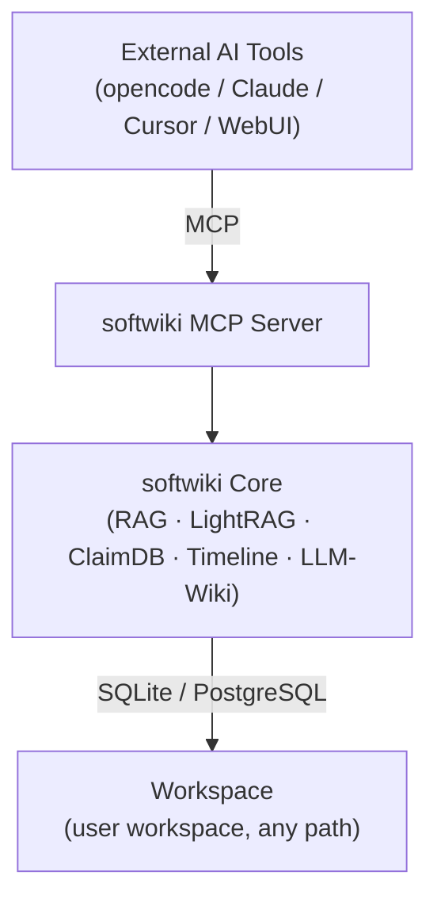

# softwiki documentation

| Category | Description |
|----------|-------------|
| [01-architecture](./01-architecture/overview.md) | System architecture, data flow, interface definitions |
| [02-design](./02-design/data-model.md) | Data models, pipeline, RAG/graph design, config schema |
| [03-operations](./03-operations/setup.md) | Setup, CLI, storage operations |
| [04-guides](./04-guides/quickstart.md) | Quickstart, Shell/WebUI usage, workflows |
| [05-roadmap](./05-roadmap/status.md) | Project status, phase planning |
| [06-archive](./06-archive/work-log.md) | Historical decisions, archived design discussions |
