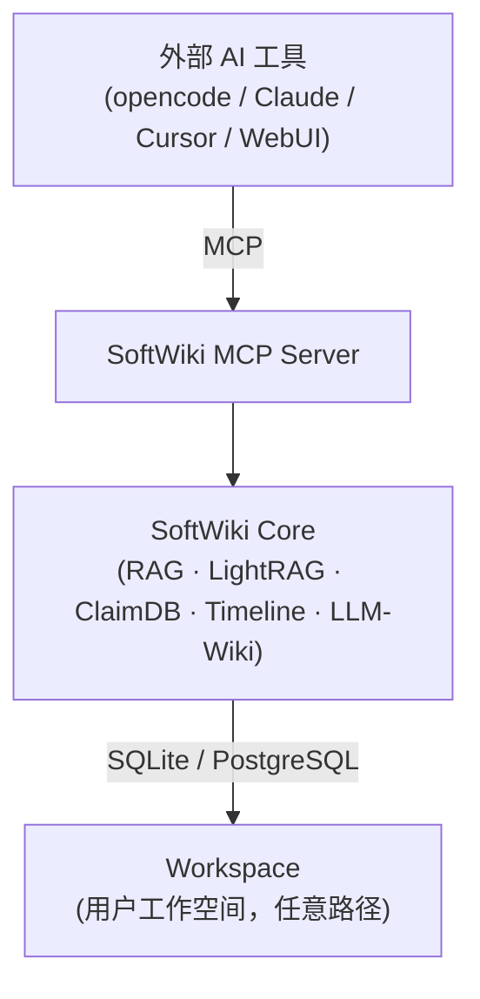

# SoftWiki 文档

| 分类 | 说明 |
|------|------|
| [01-architecture](./01-architecture/overview.md) | 系统架构、数据流、接口定义 |
| [02-design](./02-design/data-model.md) | 数据模型、管道、RAG/图设计、配置 schema |
| [03-operations](./03-operations/setup.md) | 安装、CLI、存储运维 |
| [04-guides](./04-guides/quickstart.md) | 快速上手、Shell/WebUI 用法、工作流 |
| [05-roadmap](./05-roadmap/status.md) | 项目状态、Phase 规划 |
| [06-archive](./06-archive/work-log.md) | 历史决策记录、旧架构讨论 |
