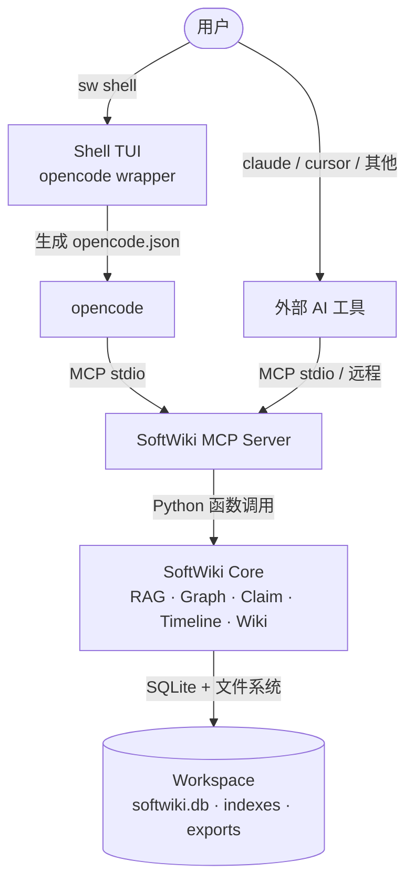

# Softwiki 系统架构与概念映射

**更新日期**：2026-06-09  
本文件说明 Softwiki 系统各层级之间的调用关系，展示人类操作和 AI 智能体意图如何通过 MCP 边界流向知识库核心。

---

## 1. 整体架构



**核心原则**：Shell 和外部工具对 Core 零直接依赖，所有知识库操作通过 MCP 边界。

---

## 2. 各层职责

### 2.1 Shell TUI（`softwiki/cli/shell.py`）

- **定位**：opencode 的配置 wrapper，独立工具，对 softwiki core 零 Python 依赖
- **作用**：生成工作空间隔离的 `opencode.json`，注入模式约束（wiki-admin / wiki-manage / wiki-work / wiki-study）
- **模型**：独立配置（`SHELL_MODEL` / `SHELL_API_BASE` / `SHELL_API_KEY`），与 Core LLM 解耦
- **Web Search**：使用 opencode 原生 `tools.websearch/webfetch`，无需额外 API key
- **Fallback REPL**（无 opencode 时）：通过 `_call_mcp_tool()` 调用本地 MCP server（stdio JSON-RPC）

### 2.2 MCP 工具层（`softwiki/mcp/server.py`）

当前已实现的 MCP tools：

| Tool | 功能 | 写权限模式限制 |
|------|------|---------------|
| `status` | 工作空间状态统计 | 无 |
| `ingest` | 摄入 URL 或本地 PDF | manage / admin |
| `index` | 重建向量和 BM25 索引 | manage / admin |
| `search` | 混合检索（返回分块） | 无 |
| `wiki_build` | 生成 Wiki 页面 | work / manage / admin |
| `ask` | RAG 问答（LLM 综合） | 无 |
| `web_search` | BYOK 网络搜索（可选） | 无 |

**技术说明**：MCP server 使用 `_stderr_print` wrapper，将所有 `print()` 重定向到 stderr，保护 stdout 的 JSON-RPC 流不被污染。

### 2.3 运行模式（SOFTWIKI_MODE）

| 模式 | 别名 | 允许操作 |
|------|------|----------|
| `wiki-study` | study | 检索、问答、状态查看（只读） |
| `wiki-work` | work | + Wiki 编译（输出到 session 目录） |
| `wiki-manage` | manage | + 摄入、重建索引 |
| `wiki-admin` | admin | 全部操作 |

### 2.4 Shell 人工指令层（Fallback REPL）

当 opencode 未安装时，fallback REPL 提供基本交互（所有操作转发给 MCP）：

| 指令 | 功能 |
|------|------|
| `/ask <问题>` | RAG 问答 |
| `/web <查询>` | BYOK Web 搜索 |
| `/ingest <url\|path>` | 摄入文档 |
| `/index` | 重建索引 |
| `/wiki <topic>` | 生成 Wiki 页面 |
| `/init` | 初始化工作空间 |
| `/status` | 查看状态 |
| `/help` | 帮助 |
| `/exit` | 退出 |

### 2.5 智能体工作流层（Agent Workflows）

在 `softwiki/templates/workflows.yaml` 中定义，供 opencode agent 参考：

- **`research`**：深度研判流（多查询 → 对比观点 → 综合简报）
- **`wiki-compile`**：百科编译流（收集证据 → 识别共识/分歧 → 生成文档）
- **`simple-q&a`**：快速问答流（单次混合查询）

### 2.6 SoftWiki Core 引擎层

| 组件 | 职责 |
|------|------|
| `AnswerEngine` | RAG 多源融合、上下文编译、LLM 综合问答 |
| `WikiPageGenerator` | LLM 驱动的结构化 Wiki 页面生成 |
| `DocumentRepository` | SQLite CRUD，ORM 操作 |
| `ClaimExtractor` | LLM 驱动的声明/立场抽取 |
| `GraphExtractor` | 实体和关系抽取，构建知识图谱 |
| `TimelineExtractor` | 时序事件抽取 |
| `HybridSearcher` | dense + BM25 混合检索（RRF 融合） |

---

## 3. 外部工具注册 MCP

任何支持 MCP 的工具（Claude Desktop、Cursor、opencode 等）可直接注册 SoftWiki：

```json
{
  "mcpServers": {
    "softwiki": {
      "command": "/path/to/venv/bin/python",
      "args": ["-m", "softwiki.mcp.server"],
      "cwd": "/path/to/softwiki",
      "env": {
        "WORKSPACE_DIR": "/path/to/your/workspace",
        "PYTHONPATH": "/path/to/softwiki",
        "SOFTWIKI_MODE": "wiki-admin"
      }
    }
  }
}
```

---

## 4. 下一步（未实现）

- **远程 MCP**：HTTPS + Bearer token，替代 stdio 本地模式
- **更多 MCP tools**：`wiki.read` / `source.preview` / `retrieve` / `graph.query` / `claim.query`
- **Token / RBAC**：正式 token 机制，替代当前基于 env 的 honor system
- **WebUI**：Next.js 前端通过 REST API 访问 Core
